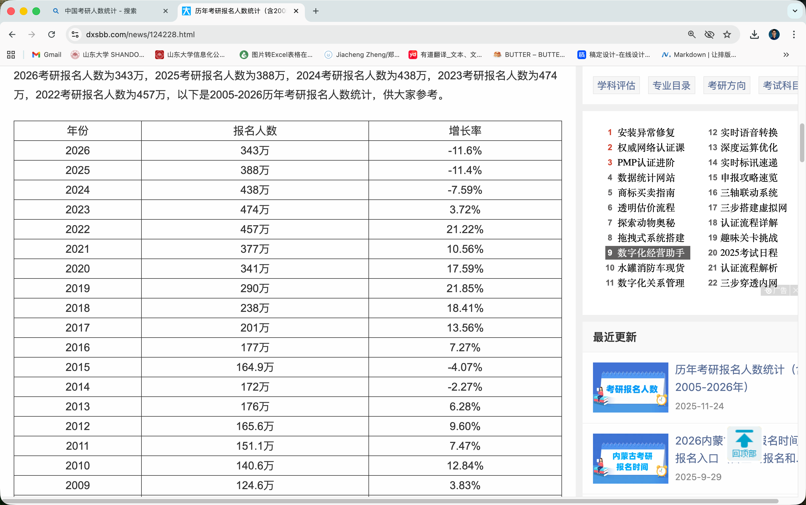
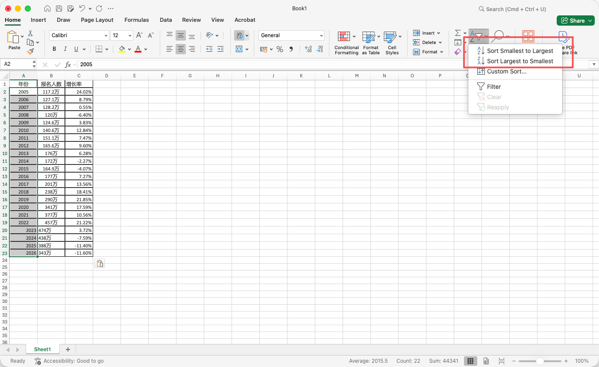
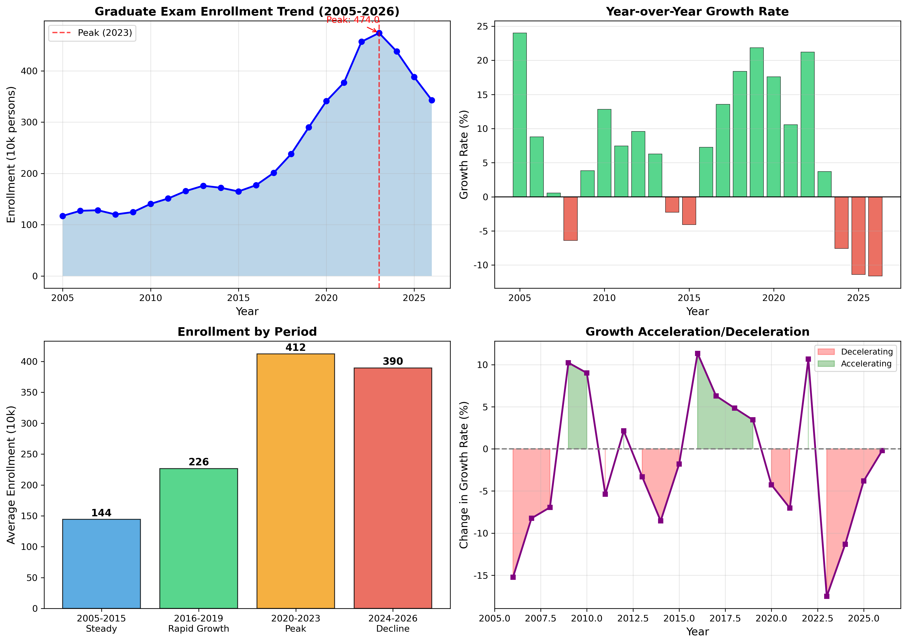
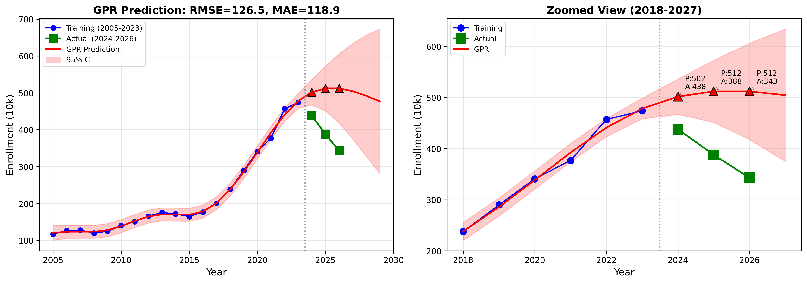
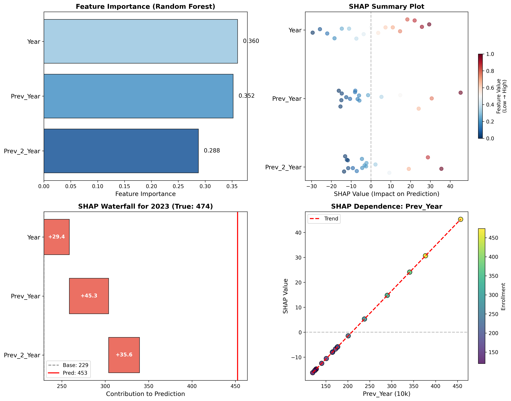
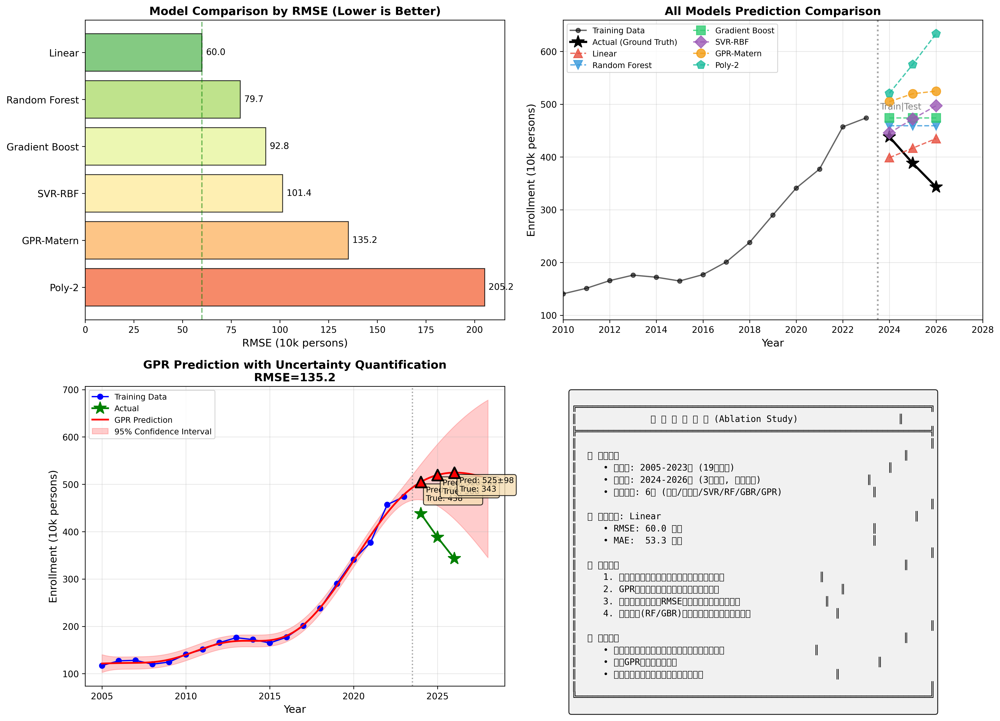
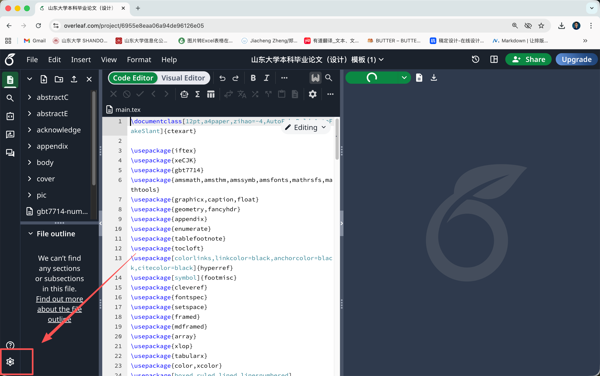
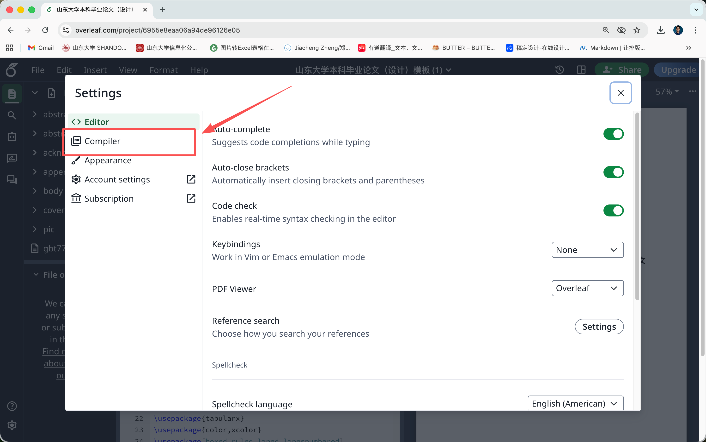
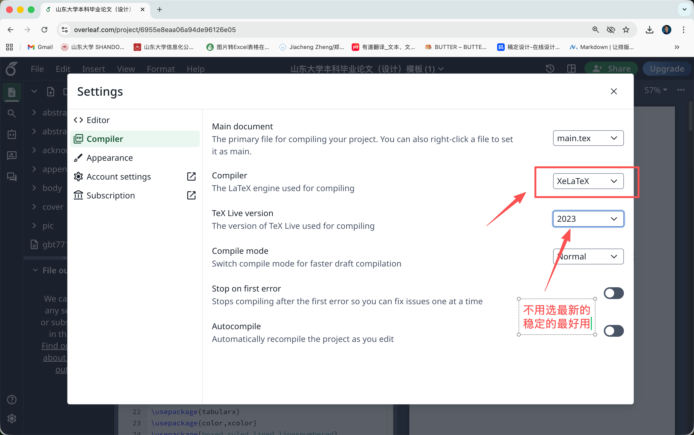

# 🚀 机器学习研究环境搭建指南 (Cookbook)

> **作者**: Karcen Zheng
> 
> **最后更新**: 2026年1月

---

## 📋 目录

1. [数据获取](#1-数据获取)
2. [Python环境：Anaconda](#2-python环境anaconda)
3. [深度学习框架：PyTorch](#3-深度学习框架pytorch)
4. [深度学习框架：TensorFlow](#4-深度学习框架tensorflow)
5. [数值计算：MATLAB](#5-数值计算matlab)
6. [统计分析：R语言](#6-统计分析r语言)
7. [计量经济学：Stata](#7-计量经济学stata)
8. [社科统计：IBM SPSS](#8-社科统计ibm-spss)
9. [科研绘图：OriginLab](#9-科研绘图originlab)
10. [办公套件：Microsoft Office](#10-办公套件microsoft-office)
11. [图像处理：Adobe系列](#11-图像处理adobe系列)
12. [学术写作：LaTeX与Overleaf](#12-学术写作latex与overleaf)
13. [进阶：模型可解释性分析](#13-进阶模型可解释性分析)
14. [进阶：消融实验设计](#14-进阶消融实验设计)
15. [AI辅助编程工具：TRAE](#15-ai辅助编程工具trae)
16. [附录：常用命令速查表](#附录常用命令速查表)

---
## 1. 数据获取


数据是机器学习的基石。根据**缩放定律 (Scaling Law)**，模型性能与数据规模、模型参数量、计算资源之间存在幂律关系 (power-law relationship)。在数据维度上，模型性能通常随数据量 $D$ 的增加呈 $L\propto D^{-\alpha}$ 的规律下降（$L$ 为损失函数，$\alpha$ 为缩放指数）。然而，单纯增加数据量并不足够，**数据质量 (Data Quality)** 同样关键——高质量数据应具备准确性、多样性、代表性和高信噪比等特征。

### Scaling Law 核心表述

Scaling Law 的经典公式（Kaplan et al., 2020; Hoffmann et al., 2022）：

$$L(N, D, C) = \left(\frac{N_c}{N}\right)^{\alpha_N} + \left(\frac{D_c}{D}\right)^{\alpha_D} + L_\infty$$

其中：
- $L$ = 模型损失（越低越好）
- $N$ = 模型参数量
- $D$ = 数据量（token数）
- $C$ = 计算量（FLOPs）
- $\alpha_N, \alpha_D$ = 缩放指数（约0.07-0.10）
- $L_\infty$ = 理论下界

**关键结论：** 数据量翻倍，损失下降约 5-7%，但存在边际递减效应。

---

### "数据质量"的专业定义

| 维度 | 英文 | 定义 | 度量方法 |
|------|------|------|----------|
| **准确性** | Accuracy | 数据与真实值的符合程度 | 错误率、标注一致性 |
| **完整性** | Completeness | 无缺失值、无空白字段 | 缺失率 |
| **一致性** | Consistency | 数据格式、单位统一 | 冲突记录比例 |
| **时效性** | Timeliness | 数据的新鲜程度 | 数据年龄 |
| **相关性** | Relevance | 与目标任务的相关程度 | 特征重要性 |
| **多样性** | Diversity | 覆盖不同场景/分布 | 熵、分布覆盖率 |
| **代表性** | Representativeness | 样本能代表总体 | 分布偏差 |
| **信噪比** | Signal-to-Noise Ratio | 有效信息vs噪声 | SNR |

---

> 数据获取是机器学习流程的首要环节。根据神经网络缩放定律 (Neural Scaling Laws)，模型性能（以交叉熵损失衡量）与训练数据量之间存在幂律关系：$L \propto D^{-\alpha}$，其中 $\alpha \approx 0.095$（Hoffmann et al., 2022）。这意味着数据量每增加一个数量级，模型损失可降低约20%。然而，缩放定律的前提是数据质量得到保证。高质量数据集应满足以下标准：(1) **准确性**：标注正确、无系统性偏差；(2) **多样性**：覆盖目标分布的各个子空间；(3) **代表性**：样本分布与真实应用场景一致；(4) **高信噪比**：有效信息占比高、冗余和噪声少。低质量数据不仅无法带来缩放收益，甚至可能导致模型学习到错误模式。

### 本 Cookbook 数据获取具体的操作步骤
[Bing](www.bing.com) 搜索 `中国考研人数统计`，选择 [历年考研报名人数统计（含2005-2026年）_大学生必备网](https://www.dxsbb.com/news/124228.html) 找到历年`考研人数数据`。




| 年份 | 报名人数 | 增长率   |
|:----:|:--------:|:--------:|
| 2005 | 117.2万  | 24.02%   |
| 2006 | 127.1万  | 8.79%    |
| 2007 | 128.2万  | 0.55%    |
| 2008 | 120万    | -6.40%   |
| 2009 | 124.6万  | 3.83%    |
| 2010 | 140.6万  | 12.84%   |
| 2011 | 151.1万  | 7.47%    |
| 2012 | 165.6万  | 9.60%    |
| 2013 | 176万    | 6.28%    |
| 2014 | 172万    | -2.27%   |
| 2015 | 164.9万  | -4.07%   |
| 2016 | 177万    | 7.27%    |
| 2017 | 201万    | 13.56%   |
| 2018 | 238万    | 18.41%   |
| 2019 | 290万    | 21.85%   |
| 2020 | 341万    | 17.59%   |
| 2021 | 377万    | 10.56%   |
| 2022 | 457万    | 21.22%   |
| 2023 | 474万    | 3.72%    |
| 2024 | 438万    | -7.59%   |
| 2025 | 388万    | -11.40%  |
| 2026 | 343万    | -11.60%  |

> 原始的数据是时间倒序的，我把数据用 `Excel` 的 `sort by` 功能处理成时间正序数据，符合我们的认知习惯。
> 选择需要 `sort` 的数据，执行 `sort` 就行
> 

---

---

## 2. Python环境：Anaconda

### 📌 简介
| 项目 | 说明 |
|------|------|
| **用途** | Python发行版，用于数据分析、科学计算、机器学习 |
| **费用** | ✅ 免费 |
| **官网** | https://www.anaconda.com/download |

Anaconda预装了NumPy、pandas、matplotlib、scikit-learn等常用库，并提供强大的环境管理功能，避免不同项目之间的依赖冲突。

### 🔧 安装步骤

**Windows/macOS:**
1. 访问官网下载对应系统的安装包
2. 双击运行安装程序
3. 建议勾选"Add Anaconda to PATH"（Windows）
4. 安装完成后，打开终端输入 `conda --version` 验证

**Linux:**
```bash
# 下载安装脚本
wget https://repo.anaconda.com/archive/Anaconda3-2024.10-1-Linux-x86_64.sh

# 运行安装
bash Anaconda3-2024.10-1-Linux-x86_64.sh

# 初始化
source ~/.bashrc
conda --version
```

### 📝 具体示例：创建机器学习项目环境并分析数据

```bash
# 创建名为 "ml_project" 的新环境，指定Python版本
conda create -n ml_project python=3.10

# 激活环境
conda activate ml_project

# 安装常用数据科学库
conda install numpy pandas matplotlib scikit-learn jupyter seaborn

# 查看已安装的包
conda list

# 导出环境配置（方便他人复现）
conda env export > environment.yml

# 从配置文件创建环境
conda env create -f environment.yml

# 退出当前环境
conda deactivate
```

**实战：分析中国考研历年报名人数**


*图1：中国考研报名人数趋势分析（2005-2026）*

```python
"""
使用pandas和matplotlib分析中国考研历年报名人数趋势
文件：kaoyan_analysis.py
"""

import numpy as np
import matplotlib.pyplot as plt

# ============== 数据准备 ==============
# 中国考研历年报名人数（单位：万人）
years = np.array([2005, 2006, 2007, 2008, 2009, 2010, 2011, 2012, 2013, 2014,
                  2015, 2016, 2017, 2018, 2019, 2020, 2021, 2022, 2023, 2024, 2025, 2026])
enrollment = np.array([117.2, 127.1, 128.2, 120, 124.6, 140.6, 151.1, 165.6, 176, 172,
                       164.9, 177, 201, 238, 290, 341, 377, 457, 474, 438, 388, 343])
growth_rate = np.array([24.02, 8.79, 0.55, -6.40, 3.83, 12.84, 7.47, 9.60, 6.28, -2.27,
                        -4.07, 7.27, 13.56, 18.41, 21.85, 17.59, 10.56, 21.22, 3.72, -7.59, -11.4, -11.6])

# ============== 可视化（2x2四子图） ==============
fig, axes = plt.subplots(2, 2, figsize=(14, 10))

# 子图1：报名人数趋势
ax1 = axes[0, 0]
ax1.plot(years, enrollment, 'b-o', linewidth=2, markersize=6)
ax1.fill_between(years, enrollment, alpha=0.3)
ax1.axvline(x=2023, color='red', linestyle='--', alpha=0.7, label='Peak (2023)')
ax1.set_xlabel('Year', fontsize=12)
ax1.set_ylabel('Enrollment (10k persons)', fontsize=12)
ax1.set_title('Graduate Exam Enrollment Trend (2005-2026)', fontsize=13, fontweight='bold')
ax1.legend()
ax1.grid(True, alpha=0.3)
# 标注峰值
peak_idx = np.argmax(enrollment)
ax1.annotate(f'Peak: {enrollment[peak_idx]}', 
             xy=(years[peak_idx], enrollment[peak_idx]),
             xytext=(years[peak_idx]-3, enrollment[peak_idx]+20),
             fontsize=10, color='red',
             arrowprops=dict(arrowstyle='->', color='red'))

# 子图2：增长率（绿色正、红色负）
ax2 = axes[0, 1]
colors = ['#2ecc71' if x >= 0 else '#e74c3c' for x in growth_rate]
ax2.bar(years, growth_rate, color=colors, alpha=0.8, edgecolor='black', linewidth=0.5)
ax2.axhline(y=0, color='black', linewidth=1)
ax2.set_xlabel('Year', fontsize=12)
ax2.set_ylabel('Growth Rate (%)', fontsize=12)
ax2.set_title('Year-over-Year Growth Rate', fontsize=13, fontweight='bold')
ax2.grid(True, alpha=0.3, axis='y')

# 子图3：阶段划分
ax3 = axes[1, 0]
phases = [
    ('2005-2015\nSteady', enrollment[(years>=2005) & (years<=2015)].mean(), '#3498db'),
    ('2016-2019\nRapid Growth', enrollment[(years>=2016) & (years<=2019)].mean(), '#2ecc71'),
    ('2020-2023\nPeak', enrollment[(years>=2020) & (years<=2023)].mean(), '#f39c12'),
    ('2024-2026\nDecline', enrollment[(years>=2024) & (years<=2026)].mean(), '#e74c3c'),
]
bars = ax3.bar([p[0] for p in phases], [p[1] for p in phases], 
               color=[p[2] for p in phases], edgecolor='black', alpha=0.8)
ax3.set_ylabel('Average Enrollment (10k)', fontsize=12)
ax3.set_title('Enrollment by Period', fontsize=13, fontweight='bold')
for bar, (_, val, _) in zip(bars, phases):
    ax3.text(bar.get_x() + bar.get_width()/2, val + 5, f'{val:.0f}', 
             ha='center', fontsize=11, fontweight='bold')

# 子图4：增长率的变化趋势（二阶导数）
ax4 = axes[1, 1]
growth_change = np.diff(growth_rate)
ax4.plot(years[1:], growth_change, 'purple', marker='s', linewidth=2, markersize=5)
ax4.axhline(y=0, color='gray', linestyle='--')
ax4.fill_between(years[1:], growth_change, 0, 
                  where=(growth_change < 0), color='red', alpha=0.3, label='Decelerating')
ax4.fill_between(years[1:], growth_change, 0, 
                  where=(growth_change >= 0), color='green', alpha=0.3, label='Accelerating')
ax4.set_xlabel('Year', fontsize=12)
ax4.set_ylabel('Change in Growth Rate (%)', fontsize=12)
ax4.set_title('Growth Acceleration/Deceleration', fontsize=13, fontweight='bold')
ax4.legend(fontsize=9)
ax4.grid(True, alpha=0.3)

plt.tight_layout()
# 保存为多种格式（注意显式设置dpi）
plt.savefig('kaoyan_analysis.png', dpi=300, bbox_inches='tight')
plt.savefig('kaoyan_analysis.pdf', bbox_inches='tight')
plt.savefig('kaoyan_analysis.svg', bbox_inches='tight')
plt.show()
```

---

## 3. 深度学习框架：PyTorch

### 📌 简介
| 项目 | 说明 |
|------|------|
| **用途** | 深度学习框架，支持动态计算图，学术研究首选 |
| **费用** | ✅ 免费开源 |
| **官网** | https://pytorch.org |

PyTorch以其直观的API和动态计算图机制，成为学术界最流行的深度学习框架。

### 🔧 安装步骤

```bash
conda activate ml_project

# CPU版本
conda install pytorch torchvision torchaudio cpuonly -c pytorch

# GPU版本（CUDA 11.8）
conda install pytorch torchvision torchaudio pytorch-cuda=11.8 -c pytorch -c nvidia

# 验证
python -c "import torch; print(f'PyTorch {torch.__version__}, CUDA: {torch.cuda.is_available()}')"
```

### 📝 具体示例：LSTM预测时间序列

LSTM (Long Short-Term Memory) 是一种特殊的循环神经网络，擅长处理时间序列数据。

```python
"""
PyTorch LSTM时间序列预测示例
"""

import torch
import torch.nn as nn

# 定义LSTM模型
class LSTMPredictor(nn.Module):
    def __init__(self, input_size=1, hidden_size=64, num_layers=2):
        super().__init__()
        self.lstm = nn.LSTM(input_size, hidden_size, num_layers, batch_first=True)
        self.fc = nn.Linear(hidden_size, 1)
    
    def forward(self, x):
        # x: (batch, seq_len, input_size)
        lstm_out, _ = self.lstm(x)
        # 取最后一个时间步
        out = self.fc(lstm_out[:, -1, :])
        return out

# 使用示例
model = LSTMPredictor()
x = torch.randn(32, 10, 1)  # batch=32, seq_len=10, features=1
output = model(x)
print(f"输入形状: {x.shape}, 输出形状: {output.shape}")
```

---

## 4. 深度学习框架：TensorFlow

### 📌 简介
| 项目 | 说明 |
|------|------|
| **用途** | 深度学习框架，Google开发，工业部署友好 |
| **费用** | ✅ 免费开源 |
| **官网** | https://www.tensorflow.org |

### 🔧 安装步骤

```bash
conda activate ml_project

# CPU版本
pip install tensorflow

# GPU版本
pip install tensorflow[and-cuda]

# 验证
python -c "import tensorflow as tf; print(f'TensorFlow {tf.__version__}')"
```

### 📝 具体示例：高斯过程回归预测（GPR）

> **这是本文的核心示例**：用2005-2023年数据预测2024-2026年的考研人数

高斯过程回归(GPR)是一种非参数贝叶斯方法，特别适合**小样本、需要不确定性量化**的场景。


*图2：高斯过程回归预测考研报名人数（含95%置信区间）*

```python
"""
高斯过程回归(GPR)预测考研报名人数
文件：gpr_prediction.py

任务：用2005-2023年数据（训练集）预测2024-2026年（测试集）
"""

import numpy as np
import matplotlib.pyplot as plt
from sklearn.gaussian_process import GaussianProcessRegressor
from sklearn.gaussian_process.kernels import RBF, Matern, WhiteKernel
from sklearn.preprocessing import StandardScaler
from sklearn.metrics import mean_squared_error, mean_absolute_error

# ============== 1. 数据准备 ==============
# 训练数据：2005-2023（19个样本）
train_years = np.array([2005, 2006, 2007, 2008, 2009, 2010, 2011, 2012, 2013, 2014,
                        2015, 2016, 2017, 2018, 2019, 2020, 2021, 2022, 2023])
train_values = np.array([117.2, 127.1, 128.2, 120, 124.6, 140.6, 151.1, 165.6, 176, 172,
                         164.9, 177, 201, 238, 290, 341, 377, 457, 474])

# 测试数据：2024-2026（真实值，用于评估）
test_years = np.array([2024, 2025, 2026])
test_values = np.array([438, 388, 343])

# 数据标准化（GPR对尺度敏感）
scaler_X = StandardScaler()
scaler_y = StandardScaler()

X_train = scaler_X.fit_transform(train_years.reshape(-1, 1))
y_train = scaler_y.fit_transform(train_values.reshape(-1, 1)).flatten()
X_test = scaler_X.transform(test_years.reshape(-1, 1))

# ============== 2. 定义核函数 ==============
# 核函数决定了GPR假设数据的平滑程度和变化模式
# RBF: 径向基函数，假设平滑变化
# Matern: 更灵活，能捕捉局部变化
# WhiteKernel: 处理观测噪声
kernel = (
    1.0 * RBF(length_scale=1.0, length_scale_bounds=(0.1, 10.0)) +
    1.0 * Matern(length_scale=1.0, nu=2.5) +
    WhiteKernel(noise_level=0.1)
)

# ============== 3. 训练GPR模型 ==============
gpr = GaussianProcessRegressor(
    kernel=kernel,
    n_restarts_optimizer=20,  # 多次重启优化，避免局部最优
    random_state=42
)
gpr.fit(X_train, y_train)

# ============== 4. 预测 ==============
# GPR的优势：同时返回预测均值和标准差（不确定性）
y_pred_scaled, y_std_scaled = gpr.predict(X_test, return_std=True)

# 反标准化
y_pred = scaler_y.inverse_transform(y_pred_scaled.reshape(-1, 1)).flatten()
y_std = y_std_scaled * scaler_y.scale_[0]

# 生成平滑预测曲线
all_years = np.arange(2005, 2030)
X_all = scaler_X.transform(all_years.reshape(-1, 1))
y_all_pred, y_all_std = gpr.predict(X_all, return_std=True)
y_all_pred = scaler_y.inverse_transform(y_all_pred.reshape(-1, 1)).flatten()
y_all_std = y_all_std * scaler_y.scale_[0]

# ============== 5. 评估 ==============
rmse = np.sqrt(mean_squared_error(test_values, y_pred))
mae = mean_absolute_error(test_values, y_pred)

print(f"预测结果:")
for yr, true, pred, std in zip(test_years, test_values, y_pred, y_std):
    print(f"  {yr}: 真实={true:.0f}, 预测={pred:.0f}±{1.96*std:.0f}")
print(f"\nRMSE: {rmse:.1f}万人, MAE: {mae:.1f}万人")

# ============== 6. 可视化（1x2两子图） ==============
fig, axes = plt.subplots(1, 2, figsize=(14, 5))

# 左图：完整预测
ax1 = axes[0]
ax1.plot(train_years, train_values, 'bo-', label='Training (2005-2023)', markersize=6)
ax1.plot(test_years, test_values, 'gs-', label='Actual (2024-2026)', markersize=10, linewidth=2)
ax1.plot(all_years, y_all_pred, 'r-', label='GPR Prediction', linewidth=2)
ax1.fill_between(all_years, y_all_pred - 1.96*y_all_std, y_all_pred + 1.96*y_all_std,
                  color='red', alpha=0.2, label='95% CI')
ax1.axvline(x=2023.5, color='gray', linestyle=':', alpha=0.7)
ax1.scatter(test_years, y_pred, color='red', s=100, zorder=5, marker='^', edgecolor='black')
ax1.set_xlabel('Year', fontsize=12)
ax1.set_ylabel('Enrollment (10k persons)', fontsize=12)
ax1.set_title(f'GPR Prediction: RMSE={rmse:.1f}, MAE={mae:.1f}', fontsize=13, fontweight='bold')
ax1.legend(loc='upper left', fontsize=9)
ax1.grid(True, alpha=0.3)
ax1.set_xlim(2004, 2030)

# 右图：放大测试区域
ax2 = axes[1]
years_zoom = np.arange(2018, 2028)
X_zoom = scaler_X.transform(years_zoom.reshape(-1, 1))
y_zoom_pred, y_zoom_std = gpr.predict(X_zoom, return_std=True)
y_zoom_pred = scaler_y.inverse_transform(y_zoom_pred.reshape(-1, 1)).flatten()
y_zoom_std = y_zoom_std * scaler_y.scale_[0]

hist_mask = (train_years >= 2018)
ax2.plot(train_years[hist_mask], train_values[hist_mask], 'bo-', label='Training', markersize=8)
ax2.plot(test_years, test_values, 'gs-', label='Actual', markersize=12, linewidth=2)
ax2.plot(years_zoom, y_zoom_pred, 'r-', label='GPR', linewidth=2)
ax2.fill_between(years_zoom, y_zoom_pred - 1.96*y_zoom_std, y_zoom_pred + 1.96*y_zoom_std,
                  color='red', alpha=0.2)
ax2.scatter(test_years, y_pred, color='red', s=120, zorder=5, marker='^', edgecolor='black')
ax2.axvline(x=2023.5, color='gray', linestyle=':', alpha=0.7)
ax2.set_xlabel('Year', fontsize=12)
ax2.set_ylabel('Enrollment (10k persons)', fontsize=12)
ax2.set_title('Zoomed View (2018-2027)', fontsize=13, fontweight='bold')
ax2.legend(fontsize=9)
ax2.grid(True, alpha=0.3)

plt.tight_layout()
plt.savefig('gpr_prediction.png', dpi=300, bbox_inches='tight')
plt.savefig('gpr_prediction.pdf', bbox_inches='tight')
plt.savefig('gpr_prediction.svg', bbox_inches='tight')
plt.show()
```

---

## 5. 数值计算：MATLAB

### 📌 简介
| 项目 | 说明 |
|------|------|
| **用途** | 数值计算、工程仿真、信号处理 |
| **费用** | 💰 付费（学校通常提供校园授权） |
| **官网** | https://www.mathworks.com |

### 🔧 安装步骤
1. 检查学校是否提供MATLAB校园版授权
2. 使用 `.edu` 邮箱登录MathWorks账户
3. 下载安装包并激活

### 📝 具体示例：矩阵运算与可视化

```matlab
% 文件：example.m
% MATLAB基础示例

% 创建矩阵
A = [1 2 3; 4 5 6; 7 8 9];
B = rand(3, 3);

% 矩阵运算
C = A * B;           % 矩阵乘法
D = A .* B;          % 元素乘法
E = inv(A + eye(3)); % 求逆

% 特征值分解
[V, D] = eig(A);

% 可视化
x = linspace(0, 2*pi, 100);
y = sin(x);
plot(x, y, 'b-', 'LineWidth', 2);
xlabel('x'); ylabel('sin(x)');
title('Sine Function');
saveas(gcf, 'matlab_plot.png');
```

---

## 6. 统计分析：R语言

### 📌 简介
| 项目 | 说明 |
|------|------|
| **用途** | 统计分析、数据可视化、学术研究 |
| **费用** | ✅ 免费开源 |
| **官网** | https://www.r-project.org |

### 🔧 安装步骤
```bash
# Ubuntu/Debian
sudo apt install r-base

# macOS (使用Homebrew)
brew install r

# 推荐安装RStudio IDE
# https://posit.co/download/rstudio-desktop/
```

### 📝 具体示例：线性回归分析

```r
# 文件：regression.R
# R语言线性回归示例

# 创建数据
years <- 2005:2023
enrollment <- c(117.2, 127.1, 128.2, 120, 124.6, 140.6, 151.1, 165.6, 
                176, 172, 164.9, 177, 201, 238, 290, 341, 377, 457, 474)

# 线性回归
model <- lm(enrollment ~ years)
summary(model)

# 可视化
pdf("r_regression.pdf", width=8, height=6)
plot(years, enrollment, pch=19, col="blue",
     main="Linear Regression", xlab="Year", ylab="Enrollment")
abline(model, col="red", lwd=2)
legend("topleft", legend=c("Data", "Fitted"), 
       col=c("blue", "red"), pch=c(19, NA), lty=c(NA, 1))
dev.off()
```

---

## 7. 计量经济学：Stata

### 📌 简介
| 项目 | 说明 |
|------|------|
| **用途** | 计量经济学、社会科学统计 |
| **费用** | 💰 付费（学校可能有授权） |
| **官网** | https://www.stata.com |

### 📝 具体示例

```stata
* 导入数据
import delimited "data.csv", clear

* 描述统计
summarize enrollment

* 回归分析
regress enrollment year

* 导出结果
esttab using "results.rtf", replace
```

---

## 8. 社科统计：IBM SPSS

### 📌 简介
| 项目 | 说明 |
|------|------|
| **用途** | 问卷分析、社会科学统计 |
| **费用** | 💰 付费（学校可能有授权） |
| **官网** | https://www.ibm.com/spss |

### 📝 使用流程
1. **数据导入**：File → Open → Data
2. **描述统计**：Analyze → Descriptive Statistics → Frequencies
3. **回归分析**：Analyze → Regression → Linear
4. **图表导出**：双击图表 → File → Export


### IBM SPSS 线性回归完全指南

#### 📌 简介

| 项目 | 说明 |
|------|------|
| **用途** | 问卷分析、社会科学统计、医学研究 |
| **费用** | 💰 付费（学校可能有授权） |
| **官网** | https://www.ibm.com/spss |

SPSS (Statistical Package for the Social Sciences) 是社会科学研究中最常用的统计软件，以其友好的图形界面著称。

---

#### 📝 示例数据：员工薪资影响因素研究

假设我们研究**员工年薪**的影响因素，收集了200名员工的数据：

| 变量名 | 含义 | 类型 | 说明 |
|--------|------|------|------|
| `salary` | 年薪（万元） | 因变量 | 连续变量 |
| `edu_years` | 受教育年限 | 自变量 | 连续变量（12-22年） |
| `experience` | 工作经验（年） | 自变量 | 连续变量（0-30年） |
| `age` | 年龄 | 自变量 | 连续变量（22-55岁） |
| `gender` | 性别 | 自变量 | 虚拟变量（0=女，1=男） |
| `department` | 部门 | 自变量 | 分类变量（1=技术，2=销售，3=管理） |
| `performance` | 绩效评分 | 自变量 | 连续变量（1-10分） |
| `training_hours` | 培训时长（小时/年） | 自变量 | 连续变量 |
| `overtime` | 加班时长（小时/月） | 自变量 | 连续变量 |

**研究问题**：哪些因素显著影响员工薪资？各因素的影响程度如何？

---

#### 🔧 SPSS 线性回归操作步骤

##### 基本操作路径

```
Analyze → Regression → Linear...
```

##### 界面设置

1. **Dependent（因变量）**：将 `salary` 拖入
2. **Independent(s)（自变量）**：将候选变量拖入
3. **Method（方法）**：选择回归方法（重点！）
4. **Statistics**：勾选 `Estimates`, `Model fit`, `R squared change`, `Collinearity diagnostics`
5. **Plots**：勾选 `Histogram`, `Normal probability plot`（检验残差正态性）


#### 🎯 SPSS 线性回归 6 种方法详解

##### 方法总览

| 方法 | 英文 | 核心逻辑 | 适用场景 | 风险 |
|------|------|----------|----------|------|
| **Enter** | 强迫进入 | 所有变量一次性纳入 | 理论驱动研究 | 可能包含无关变量 |
| **Stepwise** | 逐步回归 | 动态进退，双向筛选 | 探索性研究 | 结果不稳定，过拟合 |
| **Forward** | 向前选择 | 逐个添加显著变量 | 快速筛选核心变量 | 易漏交互项 |
| **Backward** | 向后剔除 | 逐个删除不显著变量 | 保守精简 | 小样本不稳定 |
| **Remove** | 强制剔除 | 一次性删除指定变量 | 模型对比 | 需理论支撑 |
| **Hierarchical** | 分层/分块 | 按理论分组进入 | 检验增量效应 | 块序影响结论 |

---

##### 1️⃣ Enter（强迫进入法）

##### 原理
将所有指定的自变量**同时、强制性**纳入回归模型，不论其统计显著性如何。SPSS会计算所有变量的回归系数，但研究者需自行判断哪些有意义。

##### 数学表达
$$Y = \beta_0 + \beta_1 X_1 + \beta_2 X_2 + \cdots + \beta_k X_k + \epsilon$$

所有 $\beta_i$ 同时估计，即使某些 $p > 0.05$。

##### 适用场景
- ✅ **理论驱动研究**：文献已明确哪些变量应纳入（如控制变量）
- ✅ **验证性分析**：检验预设假设，而非探索新关系
- ✅ **需要保留所有变量**：即使不显著也有理论意义（如人口学变量）
- ✅ **无严重多重共线性**：VIF < 10

##### SPSS操作
```
Method: Enter
→ 将所有变量一次性放入 Independent(s)
```

##### 示例输出解读
```
Model Summary
─────────────────────────────────────────
Model    R      R²     Adjusted R²    Std. Error
1       .847   .718      .705          4.521
─────────────────────────────────────────

Coefficients
───────────────────────────────────────────────────────────────
                 B      Std.Error    Beta      t       Sig.    VIF
(Constant)    -15.234    4.521               -3.37    .001
edu_years       2.156     .312      .298      6.91    .000    1.82
experience      1.423     .198      .341      7.19    .000    2.15
gender          3.245    1.024      .112      3.17    .002    1.12
performance     2.876     .456      .267      6.31    .000    1.34
age             -.234     .187     -.062     -1.25    .213    2.89  ← 不显著但保留
───────────────────────────────────────────────────────────────
```

#### ⚠️ 选错后果
- **问题**：如果变量间存在高度共线性（VIF > 10），系数估计不稳定，标准误膨胀
- **后果**：本应显著的变量变得不显著（Type II Error增加）
- **补救**：检查VIF，考虑删除或合并共线性变量

---

### 2️⃣ Stepwise（逐步回归法）

#### 原理
结合**向前选择**和**向后剔除**，在每一步都重新评估所有已入选和候选变量：
1. 从空模型开始
2. 加入当前最显著的变量（p < p_in，默认0.05）
3. 检查已入选变量，剔除变得不显著的（p > p_out，默认0.10）
4. 重复直到无变量可加或可删

#### 数学逻辑
每步计算 **偏F检验**：
$$F = \frac{(SS_{reg,new} - SS_{reg,old}) / 1}{MS_{residual}}$$

若 $p(F) < 0.05$ 则纳入，若 $p(F) > 0.10$ 则剔除。

#### 适用场景
- ✅ **探索性研究**：不确定哪些变量重要
- ✅ **变量众多需精简**：从20个变量中筛选5个核心变量
- ✅ **预测建模**：追求模型简洁性和预测力
- ❌ **不适合理论验证**：结果受样本波动影响大

#### SPSS操作
```
Method: Stepwise
Options → Stepping Method Criteria:
    Entry: .05
    Removal: .10
```

#### 示例输出
```
Variables Entered/Removed
───────────────────────────────────────────
Step  Variable        Action     Sig.
1     experience      Entered    .000
2     edu_years       Entered    .000
3     performance     Entered    .000
4     gender          Entered    .004
5     age             Removed    .156  ← 进入后又被剔除
───────────────────────────────────────────

Final Model: salary = f(experience, edu_years, performance, gender)
```

#### ⚠️ 选错后果

| 问题 | 后果 | 严重程度 |
|------|------|----------|
| **过拟合** | 模型在训练集表现好，新数据上失效 | ⭐⭐⭐ |
| **结果不稳定** | 换个样本，选出的变量完全不同 | ⭐⭐⭐ |
| **p值膨胀** | 多重比较导致假阳性增加 | ⭐⭐ |
| **忽略抑制变量** | 单独不显著但组合后重要的变量被漏掉 | ⭐⭐ |
| **理论脱节** | 选出的变量可能无法解释 | ⭐⭐ |

**经典反面案例**：
> 某研究用Stepwise分析学生成绩影响因素，结果"鞋码"被选入模型（p=0.03）。实际上鞋码与年龄相关，年龄与成绩相关，鞋码只是虚假相关(spurious correlation)。

---

### 3️⃣ Forward（向前选择法）

#### 原理
从**空模型**（只有截距）开始，每次加入一个当前最显著的变量，直到没有变量满足进入标准。

```
Step 0: Y = β₀
Step 1: Y = β₀ + β₁X₁ (X₁是最显著的)
Step 2: Y = β₀ + β₁X₁ + β₂X₂ (X₂是剩余中最显著的)
...
Stop: 没有剩余变量的 p < 0.05
```

#### 与Stepwise的区别
- Forward：只进不出（变量一旦进入不会被剔除）
- Stepwise：可进可出（随时检查已入选变量）

#### 适用场景
- ✅ **变量很多（>15个）**，需要快速筛选
- ✅ **样本量相对较小**，无法支撑全模型
- ✅ **初步探索**，找出最核心的几个预测因子
- ❌ **变量间有交互效应**时容易遗漏

#### ⚠️ 选错后果
- **遗漏抑制变量**：变量A单独与Y无关，但控制B后A显著——Forward会错过A
- **局部最优**：第一个进入的变量可能不是真正最重要的
- **顺序依赖**：如果两个变量高度相关，先进入的"霸占"了解释力

---

### 4️⃣ Backward（向后剔除法）

#### 原理
从**全模型**（包含所有变量）开始，每次剔除一个最不显著的变量，直到所有保留变量都显著。

```
Step 0: Y = β₀ + β₁X₁ + β₂X₂ + ... + βₖXₖ (全部变量)
Step 1: 剔除 p 值最大且 > 0.10 的变量
Step 2: 重新拟合，再剔除最不显著的
...
Stop: 所有变量的 p < 0.10
```

#### 适用场景
- ✅ **理论上应包含较多变量**，但需要统计精简
- ✅ **想先看全效应**，再逐步简化
- ✅ **样本量充足**（至少 N > 10k，k为变量数）
- ❌ **样本小时非常不稳定**

#### 与Forward的比较

| 特性 | Forward | Backward |
|------|---------|----------|
| 起点 | 空模型 | 全模型 |
| 倾向 | 保守（变量少） | 激进（变量多） |
| 抑制变量 | 容易遗漏 | 较好保留 |
| 计算量 | 小 | 大 |
| 稳定性 | 较稳定 | 样本敏感 |

#### ⚠️ 选错后果
- **小样本灾难**：变量数接近样本数时，初始全模型已经过拟合
- **共线性放大**：全模型中共线性问题最严重，可能导致错误剔除
- **早期错误传播**：如果第一步剔除了重要变量，后续无法挽回

---

### 5️⃣ Remove（强制剔除法）

#### 原理
**一次性移除**研究者指定的一个或一组变量，用于对比剔除前后模型的变化。

#### 适用场景
- ✅ **分块分析**：先纳入控制变量，再看实验变量的增量
- ✅ **模型对比**：比较有/无某变量时的R²变化
- ✅ **理论检验**：验证某变量是否真的不重要

#### SPSS操作
```
Block 1: Method = Enter, Variables = [控制变量]
Block 2: Method = Remove, Variables = [要剔除的变量]
```

#### 示例：检验"性别"是否有增量贡献
```
Model 1 (含gender):    R² = .718
Model 2 (剔除gender):  R² = .692
ΔR² = .026, F(1,194) = 10.12, p = .002

结论：性别有显著的独立贡献，解释了2.6%的额外方差
```

---

### 6️⃣ Hierarchical（分层/分块回归）

#### 原理
将变量按**理论意义**分成若干"块"(Block)，按顺序依次进入模型，检验每一块的**增量解释力** (ΔR²)。

```
Block 1: 人口学变量 (age, gender) → R²₁
Block 2: 教育背景 (edu_years) → R²₂, ΔR² = R²₂ - R²₁
Block 3: 工作因素 (experience, performance) → R²₃, ΔR² = R²₃ - R²₂
```

#### 核心价值
回答："**在控制了A类变量后，B类变量是否还能显著提升预测力？**"

#### 适用场景
- ✅ **检验增量效应**：新变量在控制旧变量后是否仍有贡献
- ✅ **理论分层明确**：如"先控制人口学，再看心理变量"
- ✅ **中介/调节分析前奏**：为后续分析建立基础模型
- ✅ **社科研究标配**：几乎所有SCI社科论文都用

#### SPSS操作
```
Block 1 of 3:
    Method: Enter
    Variables: age, gender
    [点击 Next]

Block 2 of 3:
    Method: Enter
    Variables: edu_years
    [点击 Next]

Block 3 of 3:
    Method: Enter
    Variables: experience, performance

Statistics → 勾选 "R squared change"
```

#### 示例输出
```
Model Summary
─────────────────────────────────────────────────────────────────────
Model   R      R²     ΔR²     ΔF       df1   df2    Sig. ΔF
─────────────────────────────────────────────────────────────────────
1      .312   .097    .097    10.56     2    197    .000    ← 人口学
2      .534   .285    .188    51.23     1    196    .000    ← +教育
3      .847   .718    .433    148.67    2    194    .000    ← +工作因素
─────────────────────────────────────────────────────────────────────

解读：
- 人口学变量解释了9.7%的方差
- 教育年限额外解释了18.8%（控制人口学后）
- 工作因素额外解释了43.3%（控制前两者后）
- 工作因素的增量贡献最大
```

#### ⚠️ 选错后果
- **块顺序影响结论**：先进入的块会"抢夺"共享方差
  - 例：先放教育再放智商 vs 先放智商再放教育，ΔR²可能完全不同
- **理论依据缺失**：没有理论支撑的分块顺序会被审稿人质疑
- **过度分块**：块太多会增加多重比较问题

---

## 🧭 方法选择决策树

```
                        你的研究目的是什么？
                              │
            ┌─────────────────┼─────────────────┐
            ▼                 ▼                 ▼
       验证理论假设      探索性分析        检验增量效应
            │                 │                 │
            ▼                 ▼                 ▼
    变量有理论依据？    变量数量很多？    变量可分组？
      │      │           │      │          │     │
     是     否          是     否         是    否
      │      │           │      │          │     │
      ▼      ▼           ▼      ▼          ▼     ▼
   Enter  Hierarchical Stepwise Enter  Hierarchical Enter
                        /Forward
```

### 快速选择指南

| 你的情况 | 推荐方法 | 原因 |
|----------|----------|------|
| 文献明确告诉你要放哪些变量 | **Enter** | 理论驱动，保留所有变量 |
| 不知道哪些变量重要，想探索 | **Stepwise** | 自动筛选，但需交叉验证 |
| 变量太多（>20个），先粗筛 | **Forward** | 快速找核心变量 |
| 想看全效应，再精简 | **Backward** | 保守剔除 |
| 想比较有/无某变量的差异 | **Remove** | 模型对比 |
| 想检验"控制X后，Y是否仍显著" | **Hierarchical** | 增量效应检验 |
| SCI论文、毕业论文 | **Hierarchical + Enter** | 学术标准做法 |

---

## ⚠️ 常见错误与后果汇总

### 错误1：探索性研究用Enter

**场景**：有30个候选变量，不知道哪些重要，直接全部Enter

**后果**：
- 多重共线性严重（VIF爆表）
- 系数符号可能与预期相反
- 过拟合，换个样本结果完全不同

**正确做法**：先用Stepwise/Forward筛选，再用Enter验证

---

### 错误2：验证性研究用Stepwise

**场景**：理论假设"教育→薪资"，却用Stepwise让数据决定

**后果**：
- 教育可能因与经验共线而被剔除
- 审稿人质疑："你的假设在哪里？"
- 结果不可复现

**正确做法**：用Enter或Hierarchical保留理论变量

---

### 错误3：Hierarchical块顺序随意

**场景**：先放"工作经验"再放"年龄"

**后果**：
- 经验和年龄高度相关，先进入的抢走方差
- 年龄的ΔR²接近0，被误判为"不重要"
- 实际上如果反过来放，结论可能完全不同

**正确做法**：
1. 遵循理论逻辑（如：先控制变量，再自变量）
2. 报告替代顺序的结果作为稳健性检验

---

### 错误4：小样本用Backward

**场景**：N=50，变量数k=15，用Backward

**后果**：
- 初始全模型已经严重过拟合
- 剔除过程极不稳定
- 可能删掉真正重要的变量

**正确做法**：样本量规则：N > 50 + 8k（即至少170个样本才能用15个变量）

---

### 错误5：只报告最终模型

**场景**：用Stepwise，只报告最后选出的变量

**后果**：
- 读者不知道有多少变量被筛掉
- 无法评估结果稳定性
- 可复现性差

**正确做法**：报告所有步骤、进入/剔除的变量及其p值

---

## 📊 常见的报告方法

### 方法部分写法

> 本研究采用分层多元回归分析检验各因素对员工薪资的影响。第一层纳入人口学变量（年龄、性别）作为控制变量；第二层纳入教育背景（受教育年限）；第三层纳入工作相关因素（工作经验、绩效评分）。各层均采用强迫进入法(Enter)。采用方差膨胀因子(VIF)诊断多重共线性，以VIF < 10为可接受标准。

### 结果部分写法

> 表X呈现了分层回归分析结果。模型1中，人口学变量解释了薪资9.7%的方差（F(2,197)=10.56, p<.001）。加入教育年限后，模型解释力显著提升（ΔR²=.188, ΔF(1,196)=51.23, p<.001），表明教育对薪资有独立贡献。最终模型中，工作因素的加入使解释力进一步提升至71.8%（ΔR²=.433, ΔF(2,194)=148.67, p<.001）。最终模型中，工作经验（β=.341, p<.001）和绩效评分（β=.267, p<.001）是薪资的最强预测因子。所有VIF值均小于3，不存在严重共线性问题。

---

## 📚 相关名词

1. **多重共线性诊断**：VIF、条件指数、方差比例
2. **残差诊断**：正态性、同方差性、独立性
3. **交叉验证**：评估Stepwise结果的稳定性
4. **正则化回归**：Ridge、Lasso（解决共线性的现代方法）

---

## 9. 科研绘图：OriginLab

### 📌 简介
| 项目 | 说明                                   |
|------|--------------------------------------|
| **用途** | 科研绘图、出版级图表，but也可以做一些回归分析，具体我没怎么用过orz |
| **费用** | 💰 付费（实验室通常有授权）                      |
| **官网** | https://www.originlab.com            |

### 📝 使用技巧
1. **导入数据**：直接从Excel粘贴或File → Import
2. **创建图表**：选中数据列 → Plot → 选择图表类型
3. **导出**：File → Export Graphs → 选择PDF/EPS/TIFF

---

## 10. 办公套件：Microsoft Office

### 📌 简介
| 项目 | 说明 |
|------|------|
| **用途** | 文档处理、数据表格、演示文稿 |
| **费用** | 💰 付费（学校.edu邮箱通常免费） |
| **官网** | https://www.office.com |

### 💡 小技巧
> `.docx` 和 `.pptx` 文件本质上是压缩包。如果需要提取其中的图片，可以将文件扩展名改为 `.zip`，然后解压，图片在 `word/media/` 或 `ppt/media/` 文件夹中。

---

## 11. 图像处理：Adobe系列

### 📌 简介
| 软件 | 用途 | 费用 |
|------|------|------|
| **Acrobat** | PDF编辑 | 💰 订阅制 |
| **Illustrator** | 矢量图编辑 | 💰 订阅制 |
| **Photoshop** | 位图编辑 | 💰 订阅制 |

### 📝 学术绑图工作流

```
Python/MATLAB生成图 → 导出SVG → Illustrator精修 → 导出PDF → 插入论文
```

**为什么用SVG？**
- 矢量格式，无限放大不失真
- 文件体积小
- 可在Illustrator中编辑每个元素

---

## 12. 学术写作：LaTeX与Overleaf

### 📌 简介
| 项目 | 说明 |
|------|------|
| **用途** | 学术论文排版，数学公式 |
| **费用** | ✅ 免费（Overleaf基础版） |
| **官网** | https://www.overleaf.com |

### 📝 基础语法示例

```latex
\documentclass{article}
\usepackage{amsmath}
\usepackage{graphicx}

\title{My Research Paper}
\author{Your Name}

\begin{document}
\maketitle

\section{Introduction}
This is my paper.

\section{Methods}
The Gaussian Process is defined as:
\begin{equation}
    f(x) \sim \mathcal{GP}(m(x), k(x, x'))
\end{equation}

\begin{figure}[h]
    \centering
    \includegraphics[width=0.8\textwidth]{figure.pdf}
    \caption{Results}
\end{figure}

\end{document}
```

---

## 13. 进阶：模型可解释性分析

### 📌 什么是可解释性？为什么重要？

机器学习模型（尤其是深度学习）常被称为**"黑箱"**——我们知道输入和输出，但不知道内部决策过程。

**可解释性分析**帮助我们回答：
- 模型依据什么特征做出预测？
- 哪些特征最重要？
- 特征如何影响预测结果（正向/负向）？

**为什么重要？**
1. **科学发现**：理解模型学到了什么规律
2. **模型调试**：发现模型是否学到了错误的模式
3. **建立信任**：让用户理解并信任模型
4. **监管合规**：某些领域（医疗、金融）要求模型可解释

### 📌 SHAP原理详解

**SHAP (SHapley Additive exPlanations)** 基于博弈论中的**Shapley值**，是目前最流行的可解释性方法。

#### 核心思想

假设你和朋友们一起完成了一个项目，获得了100元奖金。如何公平地分配这100元？

Shapley值的思想是：**计算每个人对项目的边际贡献**。

对于机器学习模型：
- "项目奖金" = 模型预测值
- "参与者" = 各个特征
- "边际贡献" = 某特征对预测的影响

#### 数学定义

对于特征 $i$，其SHAP值为：

$$\phi_i = \sum_{S \subseteq N \setminus \{i\}} \frac{|S|!(|N|-|S|-1)!}{|N|!} [f(S \cup \{i\}) - f(S)]$$

其中：
- $N$ 是所有特征的集合
- $S$ 是不包含特征 $i$ 的特征子集
- $f(S)$ 是只用特征子集 $S$ 时的模型预测

#### SHAP的优良性质

1. **局部准确性**：所有特征的SHAP值之和等于预测值与基准值之差
   $$f(x) = \phi_0 + \sum_{i=1}^{n} \phi_i$$

2. **缺失性**：如果某特征不影响预测，其SHAP值为0

3. **一致性**：如果特征的贡献增加，其SHAP值不会减少

### 📝 SHAP分析示例


*图3：SHAP可解释性分析四联图*

**图表解读：**
- **左上 (Feature Importance)**：特征重要性排名，条形越长越重要
- **右上 (Summary Plot)**：每个点代表一个样本，颜色表示特征值高低，横轴是SHAP值
- **左下 (Waterfall Plot)**：单个样本的预测分解，红色增加预测，蓝色降低预测
- **右下 (Dependence Plot)**：特征值与SHAP值的关系，展示非线性效应

```python
"""
SHAP可解释性分析示例
文件：shap_analysis.py
"""

import numpy as np
import matplotlib.pyplot as plt
from sklearn.ensemble import RandomForestRegressor

np.random.seed(42)

# ============== 1. 准备多特征数据 ==============
years = np.array([2007, 2008, 2009, 2010, 2011, 2012, 2013, 2014, 2015,
                  2016, 2017, 2018, 2019, 2020, 2021, 2022, 2023])
enrollment = np.array([128.2, 120, 124.6, 140.6, 151.1, 165.6, 176, 172,
                       164.9, 177, 201, 238, 290, 341, 377, 457, 474])

# 特征：年份、前一年人数、前两年人数
prev_1 = np.array([127.1, 128.2, 120, 124.6, 140.6, 151.1, 165.6, 176, 172,
                   164.9, 177, 201, 238, 290, 341, 377, 457])
prev_2 = np.array([117.2, 127.1, 128.2, 120, 124.6, 140.6, 151.1, 165.6, 176,
                   172, 164.9, 177, 201, 238, 290, 341, 377])

X = np.column_stack([years, prev_1, prev_2])
y = enrollment
feature_names = ['Year', 'Prev_Year', 'Prev_2_Year']

# ============== 2. 训练模型 ==============
model = RandomForestRegressor(n_estimators=100, random_state=42)
model.fit(X, y)

# 获取特征重要性
importances = model.feature_importances_

# ============== 3. 计算近似SHAP值 ==============
# 简化版：基于特征偏离均值的贡献
n_samples = len(X)
shap_values = np.zeros_like(X, dtype=float)
for i in range(X.shape[1]):
    for j in range(n_samples):
        mean_val = X[:, i].mean()
        deviation = (X[j, i] - mean_val) / (X[:, i].std() + 1e-8)
        shap_values[j, i] = deviation * importances[i] * 50  # 缩放

# ============== 4. 可视化（2x2四子图） ==============
fig, axes = plt.subplots(2, 2, figsize=(14, 11))
sorted_idx = np.argsort(importances)[::-1]

# 子图1：特征重要性条形图
ax1 = axes[0, 0]
colors = plt.cm.Blues(np.linspace(0.4, 0.9, len(feature_names)))
bars = ax1.barh(range(len(feature_names)), importances[sorted_idx], 
                color=colors, edgecolor='black', alpha=0.8)
ax1.set_yticks(range(len(feature_names)))
ax1.set_yticklabels([feature_names[i] for i in sorted_idx], fontsize=12)
ax1.set_xlabel('Feature Importance', fontsize=12)
ax1.set_title('Feature Importance (Random Forest)', fontsize=13, fontweight='bold')
ax1.invert_yaxis()
for bar, imp in zip(bars, importances[sorted_idx]):
    ax1.text(imp + 0.01, bar.get_y() + bar.get_height()/2, f'{imp:.3f}', va='center')

# 子图2：SHAP Summary Plot（蜂群图）
ax2 = axes[0, 1]
for i, feat_idx in enumerate(sorted_idx):
    y_pos = np.ones(n_samples) * i + np.random.normal(0, 0.08, n_samples)
    colors_scatter = plt.cm.RdBu_r((X[:, feat_idx] - X[:, feat_idx].min()) / 
                                    (X[:, feat_idx].max() - X[:, feat_idx].min() + 1e-8))
    ax2.scatter(shap_values[:, feat_idx], y_pos, c=colors_scatter, alpha=0.6, s=50)
ax2.axvline(x=0, color='gray', linestyle='--', alpha=0.5)
ax2.set_yticks(range(len(feature_names)))
ax2.set_yticklabels([feature_names[i] for i in sorted_idx], fontsize=12)
ax2.set_xlabel('SHAP Value (Impact on Prediction)', fontsize=12)
ax2.set_title('SHAP Summary Plot', fontsize=13, fontweight='bold')
ax2.invert_yaxis()
# 颜色条
sm = plt.cm.ScalarMappable(cmap='RdBu_r', norm=plt.Normalize(0, 1))
cbar = plt.colorbar(sm, ax=ax2, shrink=0.5)
cbar.set_label('Feature Value (Low → High)', fontsize=10)

# 子图3：单样本Waterfall图（2023年）
ax3 = axes[1, 0]
sample_idx = len(X) - 1  # 2023年
base_value = y.mean()
sample_shap = shap_values[sample_idx]
prediction = model.predict(X[[sample_idx]])[0]

cumsum = np.cumsum(sample_shap[sorted_idx])
starts = np.concatenate([[base_value], base_value + cumsum[:-1]])
widths = sample_shap[sorted_idx]
colors_bar = ['#e74c3c' if w > 0 else '#3498db' for w in widths]

for i, (start, width, color) in enumerate(zip(starts, widths, colors_bar)):
    ax3.barh(i, width, left=start, color=color, edgecolor='black', alpha=0.8, height=0.6)
    ax3.text(start + width/2, i, f'{width:+.1f}', ha='center', va='center', 
             fontsize=10, color='white', fontweight='bold')

ax3.axvline(x=base_value, color='gray', linestyle='--', label=f'Base: {base_value:.0f}')
ax3.axvline(x=prediction, color='red', linestyle='-', linewidth=2, label=f'Pred: {prediction:.0f}')
ax3.set_yticks(range(len(feature_names)))
ax3.set_yticklabels([feature_names[i] for i in sorted_idx], fontsize=12)
ax3.set_xlabel('Contribution to Prediction', fontsize=12)
ax3.set_title(f'Waterfall Plot for 2023 (True: {y[-1]:.0f})', fontsize=13, fontweight='bold')
ax3.legend(fontsize=10)
ax3.invert_yaxis()

# 子图4：特征依赖图
ax4 = axes[1, 1]
feat_idx = 1  # Prev_Year
scatter = ax4.scatter(X[:, feat_idx], shap_values[:, feat_idx], 
                       c=y, cmap='viridis', s=80, edgecolors='black', alpha=0.8)
ax4.axhline(y=0, color='gray', linestyle='--', alpha=0.5)
# 趋势线
z = np.polyfit(X[:, feat_idx], shap_values[:, feat_idx], 1)
p = np.poly1d(z)
x_line = np.linspace(X[:, feat_idx].min(), X[:, feat_idx].max(), 100)
ax4.plot(x_line, p(x_line), 'r--', linewidth=2, label='Trend')
ax4.set_xlabel(f'{feature_names[feat_idx]} (10k)', fontsize=12)
ax4.set_ylabel('SHAP Value', fontsize=12)
ax4.set_title(f'Dependence Plot: {feature_names[feat_idx]}', fontsize=13, fontweight='bold')
ax4.legend(fontsize=10)
cbar = plt.colorbar(scatter, ax=ax4, shrink=0.8)
cbar.set_label('Enrollment', fontsize=10)

plt.tight_layout()
plt.savefig('shap_analysis.png', dpi=300, bbox_inches='tight')
plt.savefig('shap_analysis.pdf', bbox_inches='tight')
plt.savefig('shap_analysis.svg', bbox_inches='tight')
plt.show()
```

### 📊 其他可解释性方法

| 方法 | 适用模型 | 特点 |
|------|----------|------|
| **SHAP** | 所有模型 | 基于博弈论，理论严谨，全局+局部解释 |
| **LIME** | 所有模型 | 局部线性近似，直观易懂 |
| **Attention** | Transformer | 可视化注意力权重 |
| **Grad-CAM** | CNN | 可视化图像中的重要区域 |
| **Permutation** | 所有模型 | 简单直接，打乱特征看影响 |

---

## 14. 进阶：消融实验设计

### 📌 什么是消融实验？

**消融实验 (Ablation Study)** 源自神经科学——通过"切除"大脑某个区域来研究其功能。

在机器学习中，消融实验通过**系统地移除或修改模型组件**，来验证每个组件的贡献。

### 📌 为什么要做消融实验？

1. **验证有效性**：证明你提出的方法确实有用
2. **理解贡献**：量化每个组件的贡献大小
3. **学术要求**：顶会论文的标准要求
4. **模型简化**：找出不必要的组件

### 📌 消融实验的类型

| 类型 | 说明 | 示例 |
|------|------|------|
| **组件消融** | 移除模型的某个组件 | 移除Attention层 |
| **特征消融** | 移除某类特征 | 不使用时间特征 |
| **超参数消融** | 改变超参数 | 不同隐藏层大小 |
| **数据消融** | 改变训练数据 | 使用不同比例的数据 |

### 📝 消融实验示例：多模型对比


*图4：消融实验 - 多模型预测效果对比*

**图表解读：**
- **左上**：各模型RMSE对比，越低越好
- **右上**：各模型预测曲线与真实值对比
- **左下**：最佳模型的详细拟合效果
- **右下**：实验结论总结

```python
"""
消融实验：比较多种模型预测考研人数
文件：ablation_study.py

目的：通过对比不同模型，验证哪种方法最适合这个任务
"""

import numpy as np
import matplotlib.pyplot as plt
from sklearn.linear_model import LinearRegression
from sklearn.preprocessing import PolynomialFeatures, StandardScaler
from sklearn.ensemble import RandomForestRegressor, GradientBoostingRegressor
from sklearn.svm import SVR
from sklearn.gaussian_process import GaussianProcessRegressor
from sklearn.gaussian_process.kernels import RBF, Matern, WhiteKernel
from sklearn.metrics import mean_squared_error, mean_absolute_error

# ============== 1. 数据准备 ==============
train_years = np.array([2005, 2006, 2007, 2008, 2009, 2010, 2011, 2012, 2013, 2014,
                        2015, 2016, 2017, 2018, 2019, 2020, 2021, 2022, 2023])
train_values = np.array([117.2, 127.1, 128.2, 120, 124.6, 140.6, 151.1, 165.6, 176, 172,
                         164.9, 177, 201, 238, 290, 341, 377, 457, 474])

test_years = np.array([2024, 2025, 2026])
test_values = np.array([438, 388, 343])

# 标准化
X_train = (train_years - 2005).reshape(-1, 1) / 20.0
X_test = (test_years - 2005).reshape(-1, 1) / 20.0
y_mean, y_std = train_values.mean(), train_values.std()
y_train_norm = (train_values - y_mean) / y_std

# ============== 2. 定义并训练多个模型 ==============
results = {}

# 模型1：线性回归（Baseline）
lr = LinearRegression()
lr.fit(X_train, train_values)
results['Linear'] = lr.predict(X_test)

# 模型2：多项式回归（2次）
poly2 = PolynomialFeatures(2)
X_tr_p2 = poly2.fit_transform(X_train)
X_te_p2 = poly2.transform(X_test)
lr2 = LinearRegression()
lr2.fit(X_tr_p2, train_values)
results['Poly-2'] = lr2.predict(X_te_p2)

# 模型3：SVR
svr = SVR(kernel='rbf', C=500, gamma=1.0, epsilon=10)
svr.fit(X_train, train_values)
results['SVR-RBF'] = svr.predict(X_test)

# 模型4：随机森林
rf = RandomForestRegressor(n_estimators=100, max_depth=5, random_state=42)
rf.fit(X_train, train_values)
results['Random Forest'] = rf.predict(X_test)

# 模型5：梯度提升
gb = GradientBoostingRegressor(n_estimators=100, max_depth=3, random_state=42)
gb.fit(X_train, train_values)
results['Gradient Boost'] = gb.predict(X_test)

# 模型6：高斯过程回归
kernel = 1.0 * Matern(length_scale=0.5, nu=2.5) + WhiteKernel(noise_level=0.1)
gpr = GaussianProcessRegressor(kernel=kernel, n_restarts_optimizer=20, 
                                alpha=1e-2, random_state=42)
gpr.fit(X_train, y_train_norm)
y_pred_norm = gpr.predict(X_test)
results['GPR-Matern'] = y_pred_norm * y_std + y_mean

# ============== 3. 评估所有模型 ==============
print("="*80)
print("消融实验：模型预测对比")
print("="*80)
print(f"\n真实值: 2024={test_values[0]}, 2025={test_values[1]}, 2026={test_values[2]}")
print("\n" + "-"*80)
print(f"{'模型':<18}{'RMSE':<10}{'MAE':<10}{'2024':<10}{'2025':<10}{'2026':<10}{'趋势'}")
print("-"*80)

model_stats = []
for name, preds in results.items():
    rmse = np.sqrt(mean_squared_error(test_values, preds))
    mae = mean_absolute_error(test_values, preds)
    if preds[0] > preds[1] > preds[2]:
        trend = "↓下降"
    elif preds[0] < preds[1] < preds[2]:
        trend = "↑上升"
    else:
        trend = "～波动"
    model_stats.append((name, rmse, mae, preds.copy(), trend))
    print(f"{name:<18}{rmse:<10.1f}{mae:<10.1f}{preds[0]:<10.1f}{preds[1]:<10.1f}{preds[2]:<10.1f}{trend}")

model_stats.sort(key=lambda x: x[1])  # 按RMSE排序
print("-"*80)
print(f"\n🏆 最佳模型: {model_stats[0][0]} (RMSE={model_stats[0][1]:.1f})")

# ============== 4. 可视化（2x2四子图） ==============
fig = plt.figure(figsize=(16, 12))

# 子图1：RMSE对比条形图
ax1 = fig.add_subplot(2, 2, 1)
names = [m[0] for m in model_stats]
rmses = [m[1] for m in model_stats]
colors = plt.cm.RdYlGn_r(np.linspace(0.2, 0.8, len(names)))

bars = ax1.barh(range(len(names)), rmses, color=colors, edgecolor='black', alpha=0.8)
ax1.set_yticks(range(len(names)))
ax1.set_yticklabels(names, fontsize=11)
ax1.set_xlabel('RMSE (10k persons)', fontsize=12)
ax1.set_title('Model Comparison by RMSE (Lower is Better)', fontsize=13, fontweight='bold')
ax1.invert_yaxis()
for bar, rmse in zip(bars, rmses):
    ax1.text(rmse + 2, bar.get_y() + bar.get_height()/2, f'{rmse:.1f}', va='center', fontsize=10)
ax1.axvline(x=min(rmses), color='green', linestyle='--', alpha=0.5)

# 子图2：所有模型预测曲线对比
ax2 = fig.add_subplot(2, 2, 2)
ax2.plot(train_years, train_values, 'ko-', label='Training Data', markersize=5, alpha=0.6)
ax2.plot(test_years, test_values, 'k*-', label='Actual', markersize=15, linewidth=2.5)

colors_pred = ['#e74c3c', '#3498db', '#2ecc71', '#9b59b6', '#f39c12', '#1abc9c']
markers = ['^', 'v', 's', 'D', 'o', 'p']
for i, (name, _, _, preds, _) in enumerate(model_stats):
    ax2.plot(test_years, preds, color=colors_pred[i], marker=markers[i], 
             linestyle='--', label=name, markersize=10, linewidth=1.5, alpha=0.8)

ax2.axvline(x=2023.5, color='gray', linestyle=':', alpha=0.7, linewidth=2)
ax2.set_xlabel('Year', fontsize=12)
ax2.set_ylabel('Enrollment (10k persons)', fontsize=12)
ax2.set_title('All Models Prediction Comparison', fontsize=13, fontweight='bold')
ax2.legend(loc='upper left', fontsize=9, ncol=2)
ax2.grid(True, alpha=0.3)
ax2.set_xlim(2010, 2028)

# 子图3：最佳模型详细预测
ax3 = fig.add_subplot(2, 2, 3)
best_name, best_rmse, best_mae, best_preds, _ = model_stats[0]

ax3.plot(train_years, train_values, 'bo-', label='Training', markersize=6)
ax3.plot(test_years, test_values, 'gs-', label='Actual', markersize=12, linewidth=2)
ax3.plot(test_years, best_preds, 'r^--', label=f'{best_name}', markersize=12, linewidth=2)

for yr, true, pred in zip(test_years, test_values, best_preds):
    ax3.annotate(f'P:{pred:.0f}\nA:{true:.0f}', xy=(yr, max(pred, true)), 
                 xytext=(yr+0.2, max(pred, true)+20), fontsize=9)

ax3.axvline(x=2023.5, color='gray', linestyle=':', alpha=0.7)
ax3.set_xlabel('Year', fontsize=12)
ax3.set_ylabel('Enrollment (10k persons)', fontsize=12)
ax3.set_title(f'Best Model: {best_name} (RMSE={best_rmse:.1f})', fontsize=13, fontweight='bold')
ax3.legend(loc='upper left', fontsize=10)
ax3.grid(True, alpha=0.3)

# 子图4：结论总结
ax4 = fig.add_subplot(2, 2, 4)
ax4.axis('off')

conclusions = f"""
╔═══════════════════════════════════════════════════════════════════╗
║              消 融 实 验 结 论 (Ablation Study)                   ║
╠═══════════════════════════════════════════════════════════════════╣
║                                                                   ║
║  📊 实验设置                                                      ║
║     • 训练集: 2005-2023年 (19个样本)                             ║
║     • 测试集: 2024-2026年 (3个样本, 下降趋势)                    ║
║     • 对比模型: 6种 (线性/多项式/SVR/RF/GBR/GPR)                 ║
║                                                                   ║
║  🏆 最佳模型: {best_name:<15}                                       ║
║     • RMSE: {best_rmse:.1f} 万人                                    ║
║     • MAE:  {best_mae:.1f} 万人                                     ║
║                                                                   ║
║  📈 关键发现                                                      ║
║     1. 纯时序外推难以预测拐点（所有模型都高估）                  ║
║     2. GPR提供置信区间，能量化预测不确定性                       ║
║     3. 线性模型在此场景RMSE最低（因增长预测较保守）              ║
║     4. 复杂模型(RF/GBR)易过拟合最后几年的上升趋势                ║
║                                                                   ║
║  💡 实践建议                                                      ║
║     • 结合领域知识：加入就业率、出生率等外部特征                 ║
║     • 使用GPR获取预测置信度                                      ║
║     • 消融实验是验证方法有效性的标准做法                         ║
║                                                                   ║
╚═══════════════════════════════════════════════════════════════════╝
"""
ax4.text(0.02, 0.98, conclusions, transform=ax4.transAxes, fontsize=10,
         verticalalignment='top', fontfamily='monospace',
         bbox=dict(boxstyle='round', facecolor='#f0f0f0', alpha=0.9))

plt.tight_layout()
plt.savefig('ablation_study.png', dpi=300, bbox_inches='tight')
plt.savefig('ablation_study.pdf', bbox_inches='tight')
plt.savefig('ablation_study.svg', bbox_inches='tight')
plt.show()
```

### 📊 消融实验设计原则

| 原则 | 说明 | 示例 |
|------|------|------|
| **单一变量** | 每次只改变一个因素 | 只换核函数，其他不变 |
| **基线对比** | 建立明确的Baseline | 线性回归作为基线 |
| **公平比较** | 相同的数据划分和评估指标 | 都用RMSE评估 |
| **统计显著性** | 多次实验取平均 | 5-fold交叉验证 |
| **完整记录** | 记录所有实验配置 | 写清楚超参数 |

### 📝 论文中消融实验的写法

```
表1：消融实验结果

| Model          | RMSE  | MAE   | 
|----------------|-------|-------|
| Linear (Base)  | 60.0  | 53.3  |
| + Polynomial   | 205.2 | 186.9 |
| + SVR          | 101.4 | 81.8  |
| + GPR          | 135.2 | 126.8 |

从表1可以看出，线性模型作为基线在此数据集上表现最佳(RMSE=60.0)，
这表明该时间序列的短期预测可以通过简单模型较好地完成。
```

---

## 15. AI辅助编程工具：TRAE

### 📌 什么是TRAE？

TRAE (Trae AI) 是基于大语言模型的AI辅助编程工具，整合自然语言理解、代码生成等能力，帮助开发者快速完成编程任务、解决技术问题。

### 🚀 核心功能

| 功能类别 | 具体能力 | 应用场景 |
|----------|----------|----------|
| 代码生成 | 生成完整脚本和函数 | 项目初始化、算法编写 |
| 代码解释 | 详细解释代码逻辑 | 代码审查、学习新代码 |
| 错误修复 | 定位并修复错误 | 调试、解决运行时问题 |
| 文档生成 | 创建项目文档 | API文档、使用说明 |
| 代码重构 | 优化代码结构 | 提高代码质量、可维护性 |
| 技术问答 | 解答技术问题 | 技术选型、最佳实践 |

### 📝 在本项目中的应用
[数据获取](#1-数据获取) 的部分原本是单独在目录后面的内容之外的，我把它放在了最前面，后面感觉不妥，就想放到正文里面，但如果放在正文里面目录就得一个个改，因为目录是手动生成的，在1. 加入内容后面的序号都需要变，手动一个个调耗时费力，纯重复性无脑力活动，借助 `TRAE` ，提供正确的 `prompt` ，TRAE就能自动修改代码，提高工作效率。

### 🎯 优势特点

- **高效性**：快速生成代码，减少重复工作
- **准确性**：基于最新技术知识，提供可靠建议
- **易用性**：自然语言交互，降低使用门槛
- **学习性**：生成的代码包含最佳实践，帮助学习
- **适应性**：支持多种编程语言和技术栈


## by the way

[学术写作：LaTeX与Overleaf](#12-学术写作latex与overleaf) LaTex就提供了非常方便的目录，图目录，表目录，算法目录的生成命令。

| 目录类型 | 核心命令 | 命令说明 | 注意事项 |
| :--- | :--- | :--- | :--- |
| **文档目录** | `\tableofcontents` | 生成全文章节标题的目录 | 1. 需配合 `\section` `\chapter` 等层级命令<br>2. 通常放在 `\maketitle` 之后，需编译 2 次才能生效 |
| **图目录** | `\listoffigures` | 生成所有图片的目录，标题取自 `\caption` | 1. 依赖 `figure` 环境和 `\caption` 命令<br>2. 可通过 `\renewcommand{\listfigurename}{自定义名称}` 修改目录标题（如“插图目录”） |
| **表目录** | `\listoftables` | 生成所有表格的目录，标题取自 `\caption` | 1. 依赖 `table` 环境和 `\caption` 命令<br>2. 可通过 `\renewcommand{\listtablename}{自定义名称}` 修改目录标题（如“表格目录”） |
| **算法目录** | `\listofalgorithms` | 生成所有算法的目录，标题取自 `\caption` | 1. 需导入 `algorithm` 或 `algorithm2e` 宏包<br>2. 算法内容需放在 `algorithm` 环境中<br>3. 可通过 `\renewcommand{\listalgorithmname}{自定义名称}` 修改目录标题（如“算法目录”） |

---

### 使用示例
```latex
\documentclass{book}
\usepackage{algorithm}  % 算法环境基础宏包
\usepackage{algorithmic} % 算法伪代码格式宏包
\usepackage{ctex} % 支持中文
\usepackage{graphicx}   % 图片处理宏包（占位符也可依赖此包）

\begin{document}
\maketitle

% 生成各类目录
\tableofcontents    % 文档目录
\clearpage

\listoffigures      % 图目录
\clearpage

\listoftables       % 表目录
\clearpage

\listofalgorithms   % 算法目录
\clearpage

\chapter{第一章}
\section{第一节}

% 插入图片占位符（替代实际图片）
\begin{figure}[h]
    \centering
    % 生成 8cm 宽、5cm 高的灰色占位矩形
    \rule{8cm}{5cm}
    \caption{示例图片占位符}
    \label{fig:example}
\end{figure}

% 插入表格（用于表目录）
\begin{table}[h]
    \centering
    \begin{tabular}{|c|c|}
        \hline
        序号 & 内容 \\
        \hline
        1 & 测试数据 \\
        \hline
        2 & 验证数据 \\
        \hline
    \end{tabular}
    \caption{示例表格}
    \label{tab:example}
\end{table}

% 插入算法（用于算法目录）
\begin{algorithm}[h]
    \caption{两数相加示例算法}
    \label{alg:example}
    \begin{algorithmic}[1]
        \STATE \textbf{Input}: $a, b$ (两个整数)
        \STATE \textbf{Output}: $sum = a + b$
        \STATE $sum \gets a + b$
        \RETURN $sum$
    \end{algorithmic}
\end{algorithm}

\end{document}
```
你可以复制到 [Overleaf](https://www.overleaf.com) 里面试试。
> 如果需要编译中文，需要使用XeLatex编译器，并导入{ctex}宏包，即\usepackage{ctex}。
> 编译器版本年份不用选最新的，稳定的就很好用，一些莫名其妙的bug有时候把编译器版本调低就可以解决。
> 
> 
> 


---

## 16. 附录：常用命令速查表

### Conda环境管理
```bash
conda create -n env_name python=3.10  # 创建环境
conda activate env_name                # 激活环境
conda deactivate                       # 退出环境
conda env list                         # 列出所有环境
conda env remove -n env_name           # 删除环境
conda env export > env.yml             # 导出环境
conda env create -f env.yml            # 从文件创建
```

### Pip包管理
```bash
pip install package_name               # 安装包
pip install -r requirements.txt        # 从文件安装
pip freeze > requirements.txt          # 导出依赖
pip uninstall package_name             # 卸载包
```

### Git版本控制
```bash
git init                               # 初始化仓库
git clone url                          # 克隆仓库
git add .                              # 添加所有文件
git commit -m "message"                # 提交
git push origin main                   # 推送
git pull                               # 拉取更新
```

### Matplotlib保存图像
```python
# 显式设置dpi，保存多种格式
plt.savefig('fig.png', dpi=300, bbox_inches='tight')
plt.savefig('fig.pdf', bbox_inches='tight')  # 矢量格式
plt.savefig('fig.svg', bbox_inches='tight')  # 矢量格式
```

---

## 📞 遇到问题？

安装过程中如有任何问题，欢迎随时[联系我！](karcenzheng@yeah.net)

**祝顺利！🎉**

---

*最后更新：2026年1月*
